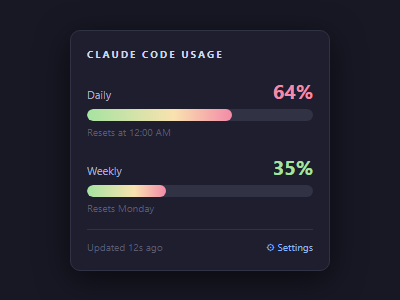
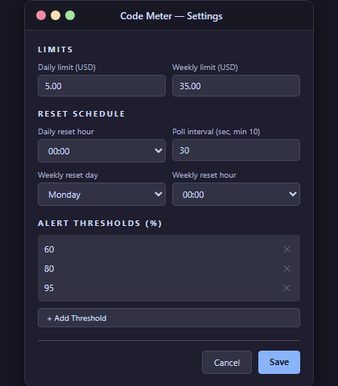
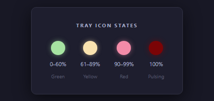
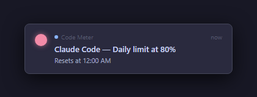

# Code Meter

> A lightweight Windows system tray app that tracks your [Claude Code](https://claude.ai/code) subscription usage in real time — no API key required.



---

## What is it?

Claude Code enforces both a **daily** and a **weekly** spending limit. Code Meter reads Claude Code's local usage logs directly from your machine and shows you exactly where you stand — before you hit the wall mid-task.

- Lives in the system tray: zero clutter, always one click away
- Reads `~/.claude/projects/**/*.jsonl` — no network calls, no API key
- Color-coded tray icon changes as you approach your limit
- Configurable toast notifications at thresholds you set

---

## Features

- **Live daily & weekly meters** — gradient progress bars update on a configurable poll interval
- **Color-coded tray icon** — green → yellow → red → pulsing dark red as usage climbs
- **Toast alerts** — Windows notifications fire the first time you cross each threshold per period
- **Fully configurable** — set your own limits, reset schedule (day + hour), poll interval, and alert thresholds
- **First-run setup** — settings window opens automatically when no config is found
- **Offline & private** — reads local log files only, never touches the network

---

## Screenshots

### Tray Popup

Left-click the tray icon to see your current usage at a glance.


### Settings Window

Right-click the tray icon → **Settings**, or click **⚙ Settings** in the popup.



### Tray Icon States

The tray icon color reflects the worst of your two usage windows.



### Toast Notifications

Windows toast notifications fire once per threshold crossing per window period.



---

## Prerequisites

| Requirement | Version |
|---|---|
| Windows | 10 or 11 |
| [.NET 8 SDK](https://dotnet.microsoft.com/download/dotnet/8.0) | 8.0+ |
| [Claude Code](https://claude.ai/code) | Any (Max or Pro subscription) |

> **Note:** Code Meter reads Claude Code's local usage logs from `~/.claude/projects/`. You must have Claude Code installed and have used it at least once for any usage to appear.

---

## Installation

### Option A — Clone and run

```bash
git clone https://github.com/jbstinson/code-meter.git
cd code-meter
dotnet run --project CodeMeter/CodeMeter.csproj
```

### Option B — Build a standalone executable

```bash
git clone https://github.com/jbstinson/code-meter.git
cd code-meter
dotnet publish CodeMeter/CodeMeter.csproj -c Release -r win-x64 --self-contained true -p:PublishSingleFile=true -o publish
```

The output will be a single `CodeMeter.exe` in the `publish/` folder. Double-click to run.

---

## First Run

On first launch, the **Settings** window opens automatically so you can configure your limits before the tray icon appears.

Fill in:
- **Daily limit** — your Claude Code daily spending cap (USD)
- **Weekly limit** — your Claude Code weekly spending cap (USD)
- **Daily reset hour** — the hour your daily counter resets (usually midnight)
- **Weekly reset day + hour** — when your weekly counter resets
- **Poll interval** — how often to re-read the logs (default: 30 seconds, minimum: 10)
- **Alert thresholds** — percentages at which you want a toast notification

Click **Save**. The app minimizes to the system tray and starts polling immediately.

---

## Usage

| Action | Result |
|---|---|
| **Left-click** tray icon | Opens the usage popup |
| **Right-click** tray icon | Opens context menu |
| Context menu → **Settings** | Opens the settings window |
| Context menu → **Refresh Now** | Forces an immediate log re-read |
| Context menu → **Exit** | Quits the app |
| Click **⚙ Settings** in popup | Opens the settings window |

---

## How It Works

```
~/.claude/projects/**/*.jsonl
          │
          ▼
    UsageReader          reads every JSONL file, filters type=assistant, costUSD>0
          │
          ▼
   UsageAggregator       sums entries within the daily/weekly window
          │
          ▼
    TrayViewModel        updates progress bars, tooltip, and icon color
          │
       ┌──┴──┐
       ▼     ▼
  TrayPopup  TrayIcon    renders the popup + colors the 16×16 GDI+ icon
             │
             ▼
       AlertService      fires Windows toasts on first threshold crossing per period
```

Claude Code writes one JSONL file per conversation to `~/.claude/projects/<project-hash>/<conversation-id>.jsonl`. Each line with `"type": "assistant"` and `"costUSD" > 0` counts toward your usage total. Code Meter sums these within your configured windows — no cloud, no API, no account required.

---

## Configuration

Settings are stored at `%APPDATA%\CodeMeter\settings.json` and can be edited directly:

```json
{
  "dailyLimitUSD": 5.00,
  "weeklyLimitUSD": 35.00,
  "dailyResetHour": 0,
  "weeklyResetDay": "Monday",
  "weeklyResetHour": 0,
  "alertThresholds": [60, 80, 95],
  "pollIntervalSeconds": 30
}
```

The file is watched between polls — external edits (e.g. from another tool) are picked up automatically on the next poll cycle.

---

## Tray Icon Color Reference

| Color | Usage band | Meaning |
|---|---|---|
| 🟢 Green | 0 – 60% | You're well within your limit |
| 🟡 Yellow | 61 – 89% | Getting close — keep an eye on it |
| 🔴 Red | 90 – 99% | Almost at your limit |
| ◉ Pulsing dark red | 100% | Limit reached |

The icon color reflects the **worse** of your daily and weekly windows.

---

## Alert Thresholds

Thresholds fire **once per window period** — you won't get spammed on every poll. The fired state resets automatically when a new daily or weekly window begins.

You can add as many thresholds as you like from the Settings window. Duplicates are silently ignored. The default set is `[60, 80, 95]`.

---

## Auto-Start on Login (optional)

Code Meter doesn't register itself to run on startup. To add it manually:

1. Press `Win + R` → type `shell:startup` → press Enter
2. Create a shortcut to `CodeMeter.exe` in the folder that opens

---

## Project Structure

```
CodeMeter/
├── App.xaml / App.xaml.cs          Entry point — wires all services, owns the tray icon
├── Core/
│   ├── UsageEntry.cs               Record: Timestamp + CostUSD
│   ├── WindowSummary.cs            Record: AmountUsed, Limit, PercentUsed, ResetsAt
│   ├── UsageReader.cs              Reads ~/.claude/projects/**/*.jsonl
│   ├── UsageAggregator.cs          Computes daily/weekly WindowSummary
│   └── PollingService.cs           System.Threading.Timer wrapper
├── Alerts/
│   └── AlertService.cs             Per-window threshold tracking + toast dispatch
├── Settings/
│   ├── AppSettings.cs              Settings POCO with defaults
│   └── SettingsStore.cs            Atomic JSON read/write to %APPDATA%\CodeMeter\
└── UI/
    ├── TrayViewModel.cs            INotifyPropertyChanged VM
    ├── TrayPopup.xaml / .cs        Left-click popup with gradient bars
    └── SettingsWindow.xaml / .cs   Settings window with dynamic threshold list

CodeMeter.Tests/
├── Core/                           UsageReader, UsageAggregator tests
├── Alerts/                         AlertService tests
├── Settings/                       SettingsStore tests
└── UI/                             TrayViewModel tests
```

---

## Running Tests

```bash
dotnet test CodeMeter.Tests/CodeMeter.Tests.csproj -v minimal
```

Expected output: **40 tests, 0 failures**.

---

## Built With

| Package | Purpose |
|---|---|
| [H.NotifyIcon.Wpf](https://github.com/HavenDV/H.NotifyIcon) | System tray icon + popup hosting |
| [Microsoft.Toolkit.Uwp.Notifications](https://github.com/CommunityToolkit/WindowsCommunityToolkit) | Windows toast notifications |
| System.Text.Json | Settings serialization (inbox in .NET 8) |
| xUnit + FluentAssertions | Tests |

---

## License

MIT
